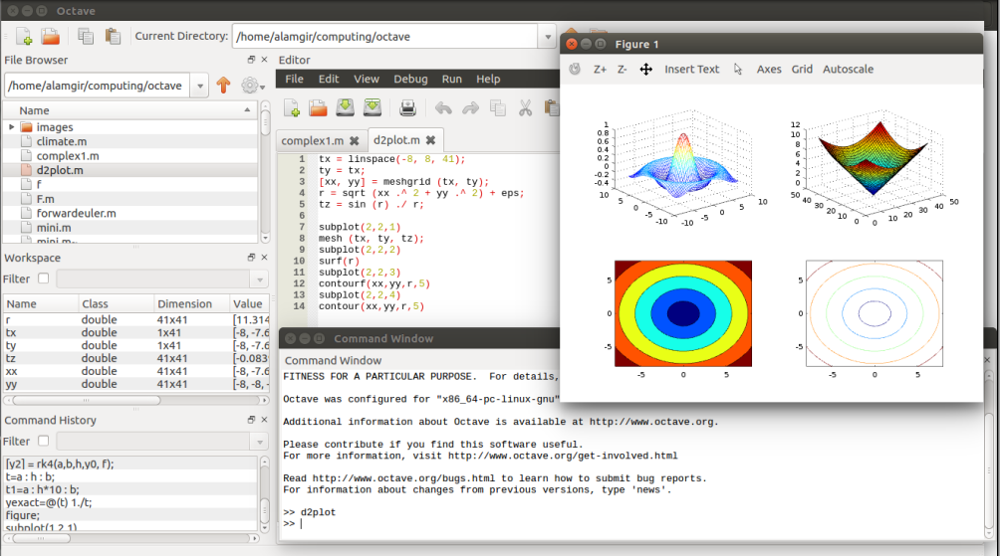
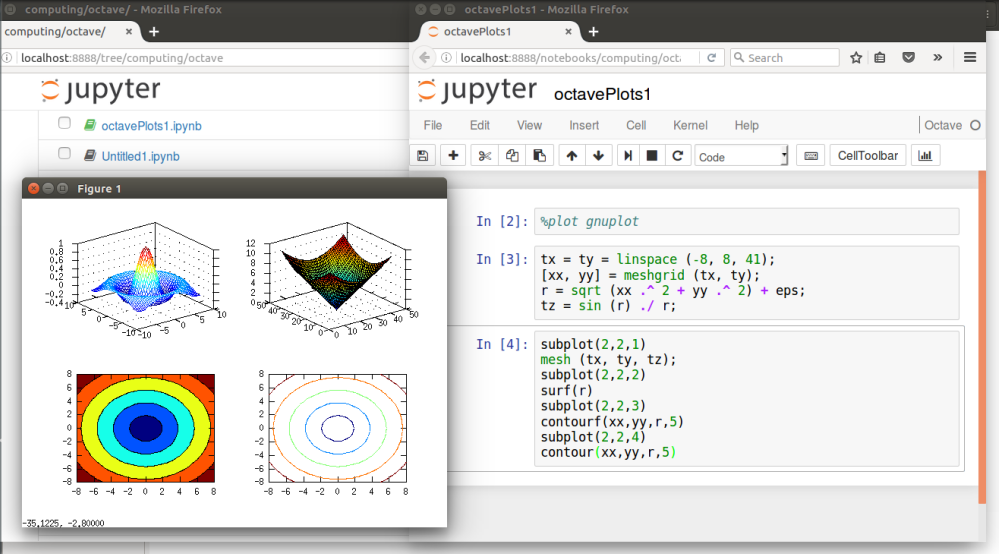

# <a href='https://alamgirh.github.io/octave/index.html'> Octave Tutorial </a>
## <a href='https://www.gnu.org/software/octave/'>About GNU Octave </a>
<ul>
<li> A high-level interpreted language </li>
<li> primarily uses for numerical computations </li> 
<li> a tool of data visualization and manipulation </li> 
<li> Octave language is quite similar to Matlab </li> 
</ul>
## Install Octave Kernel
<li> https://github.com/Calysto/octave_kernel </li>

## Contents
<ul>
<li> <a href='https://alamgirh.github.io/octave/octaveBasic.slides.html'> Basic operations </a></li>
<li> <a href='https://alamgirh.github.io/octave/octaveFunctions.slides.html'> Functions </a> </li>
<li> <a href='https://alamgirh.github.io/octave/octaveConditions.slides.html'> Conditions </a> </li>
<li> <a href='https://alamgirh.github.io/octave/octaveLoops.slides.html'> Loops </a> </li>
<li> <a href='https://alamgirh.github.io/octave/octavePlots.slides.html'> Plots </a> </li>
<li> Nummerical methods </li>
<ul> 
  <li> <a href='https://alamgirh.github.io/octave/octaveIntegrations.slides.html'> Numerical Integration </a></li>
  <li> <a href='https://alamgirh.github.io/octave/octaveDifferentiation.slides.html'> Numerical Differentiation </a></li>
  <li> <a href='https://alamgirh.github.io/octave/octaveODE.slides.html'> Ordinary Differential Equations </a></li>
</ul>
<li> Complex Analysis</li>
<ul><li> <a href='https://alamgirh.github.io/octave/octaveComplex.slides.html'> Complex Function </a> </ul>
</ul>
</ul>

 <table style="width:100%">
  <tr>
    <th>
    
</th>
    <th>
    
</th>
  </tr>
  </table> 
